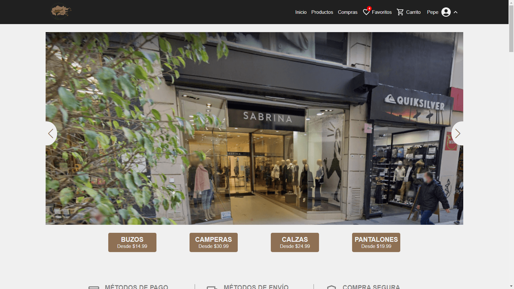

  

---

# Sabrina

Sabrina is a full-stack application for online clothing shopping. With an intuitive and friendly interface, users can browse and search for their favorite products easily. In addition, they have the option to apply filters for a more specific and efficient search. The application boasts 25 pages, including fundamental ones like Home, ProductsPage with a product catalog, CartPage, and an exclusive Dashboard accessible only to administrators. The Dashboard provides access to various statistics, tables of orders, products, and users, allowing administrators to perform operations such as deletion, update, and creation.

{:target="_blank"}

Click the image to see an overview and key features of the app in action.

## Features

- Enjoy a seamless and intuitive design that enhances the shopping experience for users of all levels.
- Explore a vast array of products across different categories, ensuring a diverse and satisfying shopping journey.
- Easily find your favorite products using advanced search filters, making the shopping process efficient and enjoyable.
- Experience a hassle-free checkout process with clear and easy-to-follow steps, ensuring a smooth transaction.
- Seamlessly complete transactions with integrated payment methods such as PayPal and MercadoPago, providing users with flexibility and convenience.
- Gain exclusive access to a comprehensive dashboard with detailed statistics, tables, and management tools for orders, products, and users.
- Benefit from a robust user authentication system with token-based security, ensuring the safety of user data.
- Enhance user security with email verification, adding an extra layer of authenticity to the registration process.
- Experience peace of mind with a password recovery feature. Users can easily restore or reset their passwords through a secure email sent by the application, ensuring a smooth recovery process.
- The application uses Cloudinary for cloud storage of product images.
- Enjoy a responsive design that adapts to various devices, providing an optimal experience on desktops, tablets, and mobiles.

## Technologies Used

### Backend

- <a href="https://nodejs.org/es" target="_blank">**Node.js**</a>: A runtime environment for executing JavaScript code server-side.
- <a href="https://expressjs.com/es/" target="_blank">**Express**</a>: A web application framework for Node.js, simplifying the creation of robust APIs.
- <a href="https://github.com/Abazhenov/express-async-handler" target="_blank">**Express Async Handler**</a>: A utility to handle exceptions in asynchronous route handlers.
- <a href="https://www.mongodb.com/es" target="_blank">**MongoDB**</a>: A NoSQL database based on a document data model used for storing and retrieving data.
- <a href="https://mongoosejs.com/" target="_blank">**Mongoose**</a>: An ODM (Object Data Modeling) library for MongoDB and Node.js.
- <a href="https://github.com/aravindnc/mongoose-paginate-v2" target="_blank">**Mongoose Paginate**</a>: Pagination support for Mongoose.
- <a href="https://www.npmjs.com/package/dotenv" target="_blank">**Dotenv**</a>: A zero-dependency module for loading environment variables.
- <a href="https://github.com/dcodeIO/bcrypt.js" target="_blank">**Bcryptjs**</a>: A library for hashing passwords.
- <a href="https://github.com/auth0/node-jsonwebtoken" target="_blank">**JWT**</a>: A library for generating and verifying JSON Web Tokens (JWT).
- <a href="https://nodemailer.com/" target="_blank">**NodeMailer**</a>: A Node.js library for sending emails.
- <a href="https://github.com/expressjs/cors" target="_blank">**Cors**</a>: Middleware for enabling Cross-Origin Resource Sharing in Express apps.
- <a href="https://github.com/expressjs/multer" target="_blank">**Multer**</a>: Middleware for handling form/multipart data, used in the application to upload image files.
- <a href="https://cloudinary.com/" target="_blank">**Cloudinary**</a>: Cloud-based service for managing and delivering images and videos.
- <a href="https://www.mercadopago.com.ar/developers/es/reference" target="_blank">**MercadoPago**</a>: Integration for handling payments using Mercado Pago.

### Frontend

- <a href="https://react.dev/" target="_blank">**React**</a>: A JavaScript library for building interactive user interfaces.
- <a href="https://www.typescriptlang.org/docs/" target="_blank">**TypeScript**</a>: A superset of JavaScript that adds static types and other features to the language syntax.
- <a href="https://sass-lang.com/documentation/" target="_blank">**Sass**</a>: A CSS preprocessor that provides additional features and a more readable syntax.
- <a href="https://axios-http.com/" target="_blank">**Axios**</a>: A popular library for making HTTP requests.
- <a href="https://tanstack.com/query/latest/docs/react/overview" target="_blank">**ReactQuery**</a>: Versatile library that simplifies the management, caching, synchronization, and updating of asynchronous data. It is often regarded as the essential data-fetching solution for web applications, streamlining the process of handling server state with ease.
- <a href="https://www.chartjs.org/docs/latest/" target="_blank">**ChartJs**</a>: JavaScript library that makes it easy to create interactive and visually appealing graphics.
- <a href="https://es.redux.js.org/" target="_blank">**Redux**</a>: A predictable state container for managing the state of a JavaScript application.
- <a href="https://reactrouter.com/en/main" target="_blank">**React Router Dom**</a>: It is a library for declarative and dynamic navigation in React applications, allowing the management of routes and views efficiently.
- <a href="https://fkhadra.github.io/react-toastify/introduction/" target="_blank">**React Toastify**</a>: It is a library that facilitates the creation of interactive and customizable notifications for React.
- <a href="https://github.com/staylor/react-helmet-async" target="_blank">**React Helmet Async**</a>: It is a React library that allows you to easily and dynamically manage document header elements (head), such as titles, meta tags and other elements, asynchronously to improve application performance.
- <a href="https://github.com/ankeetmaini/react-infinite-scroll-component" target="_blank">**React Infinite Scroll Component**</a>: Is a React component that makes it easy to implement infinite scrolling, automatically loading more content as the user gets closer to the end of the page.
- <a href="https://swiperjs.com/get-started" target="_blank">**Swiper**</a>: Library of touch sliders, designed to create smooth and responsive scrolling experiences in user interfaces.
- <a href="https://mui.com/material-ui/getting-started/" target="_blank">**Material UI**</a>: A popular React UI framework based on Material Design principles.
- <a href="https://developer.paypal.com/sdk/js/reference/" target="_blank">**PayPal**</a>: PayPal's official React integration.

## Project Structure

### Backend

- `src/controllers`: Within this directory, you'll find controller files responsible for handling the business logic and operations related to different resources. For example, product.controller.ts, order.controller.ts, and user.controller.ts.
- `src/data`: Contains data files used in the application, such as sample products and users.
- `src/models`: This directory holds the models that define the data structures used within the backend. Each model file, such as orderModel.ts, productModel.ts, userModel.ts, and request.ts, outlines the structure and properties of different data entities.
- `src/routes`:  Contains files that define the API routes and their corresponding controllers.
- `src/utilities`: Contains utilities and helper functions used in the application.

### Frontend

- `src/assets`: Contains static assets such as images and icons used in the application.
- `src/components`: Contains reusable components used in different parts of the application.
- `src/hooks`: Contains custom hooks responsible for encapsulating and managing complex logic used across various sections. The hooks are strategically divided into three separate files:
    - `userHooks.ts`: This file includes custom hooks related to user-related functionalities. It encapsulates logic such as user authentication, sign-up, and any other user-specific operations.

    - `productHooks.ts`: This file contains hooks related to products-related functionalities. It may involve logic for fetching, creating, updating or deleting product data.

    - `orderHooks.ts`: This file contains hooks related to order-related functionalities. This may include logic for fetching order history, creating new orders, deleting or updating existing ones.
- `src/models`: Contains TypeScript interfaces or types used for defining data structures.
- `src/pages`: Contains all the pages within the application. Each page has its dedicated folder with the same name, which have its corresponding file (.tsx) and potentially additional subdirectories, such as a "components" folder containing components used only in it.
- `src/redux`: This directory is dedicated to managing the application's states y reducers using Redux.
- `src/services`: The services directory encapsulates essential service files such as apiClient.ts, which is responsible for interacting with the backend API. You are responsible for configuring Axios to make HTTP requests to the appropriate server (local in development or the server deployed in production). Additionally, it includes an interceptor to attach the user's authorization token to the headers of outgoing requests if the user is authenticated.
- `src/styles`: Contains Sass style files for each page of the application. Most pages have their own Sass file, except in cases where styles are shared (for example, LoginPage.tsx and RegisterPage.tsx share AuthenticatedPages.scss).
- `src/utilities`: Contains utilities and helper functions used in the application.

## Authors

- Matías Gonta

If you have any questions, concerns or interest, feel free to contact me.

---

  

---

# Sabrina

Sabrina es una aplicación full-stack completa para comprar ropa en línea. Con una interfaz intuitiva y amigable, los usuarios pueden navegar y buscar sus productos favoritos fácilmente. Además, tienen la opción de aplicar filtros para una búsqueda más específica y eficiente. La aplicación cuenta con 25 páginas, que incluyen las fundamentales como Inicio, Productos con un catálogo de productos, Carrito y un exclusivo Panel de Control (Dashboard) accesible solo para administradores. El Panel de Control brinda acceso a diversas estadísticas, tablas de pedidos, productos y usuarios, permitiendo a los administradores realizar operaciones como eliminación, actualización y creación.

{:target="_blank"}

Haz clic en la imagen para ver una visión general y características clave de la aplicación en acción.

## Características

- Disfruta de un diseño fluido e intuitivo que mejora la experiencia de compra para los usuarios.
- Explora una extensa gama de productos en distintas categorías.
- Encuentra fácilmente tus productos favoritos utilizando filtros de búsqueda avanzados, haciendo que el proceso de compra sea eficiente y placentero.
- Experimenta un proceso de pago sin complicaciones con pasos claros y fáciles de seguir, garantizando una transacción fluida.
- Completa transacciones de forma fluida con métodos de pago integrados como PayPal y MercadoPago, brindando a los usuarios flexibilidad y comodidad.
- Obtén acceso exclusivo a un panel de control integral con estadísticas detalladas, tablas y herramientas de gestión para pedidos, productos y usuarios.
- Benefíciese de un sólido sistema de autenticación de usuarios con seguridad basada en tokens, garantizando la protección de los datos del usuario.
- Refuerza la seguridad del usuario con la verificación por correo electrónico, añadiendo una capa adicional de autenticidad al proceso de registro.
- Experimenta tranquilidad con la función de recuperación de contraseña. Los usuarios pueden restaurar o restablecer fácilmente sus contraseñas a través de un correo electrónico seguro enviado por la aplicación, garantizando un proceso de recuperación sin problemas.
- La aplicación utiliza Cloudinary para el almacenamiento en la nube de las imágenes de los productos.
- Disfruta de un diseño responsive que se adapta a diferentes dispositivos, brindando una experiencia óptima en computadoras de escritorio, tabletas y dispositivos móviles.

## Tecnologías utilizadas

### Backend

- <a href="https://nodejs.org/es" target="_blank">**Node.js**</a>: Un entorno de ejecución para llevar a cabo código JavaScript en el servidor.
- <a href="https://expressjs.com/es/" target="_blank">**Express**</a>: Un framework para Node.js que simplifica la creación de APIs sólidas.
- <a href="https://github.com/Abazhenov/express-async-handler" target="_blank">**Express Async Handler**</a>: Una utilidad para manejar excepciones en los controladores de rutas asíncronas.
- <a href="https://www.mongodb.com/es" target="_blank">**MongoDB**</a>: Una base de datos NoSQL basada en un modelo de datos de documentos utilizada para almacenar y recuperar datos.
- <a href="https://mongoosejs.com/" target="_blank">**Mongoose**</a>: Una biblioteca ODM (Mapeo de Datos de Objetos) para MongoDB y Node.js.
- <a href="https://github.com/aravindnc/mongoose-paginate-v2" target="_blank">**Mongoose Paginate**</a>: Soporte de paginación para Mongoose.
- <a href="https://www.npmjs.com/package/dotenv" target="_blank">**Dotenv**</a>: Un módulo sin dependencias para cargar variables de entorno.
- <a href="https://github.com/dcodeIO/bcrypt.js" target="_blank">**Bcryptjs**</a>: Una biblioteca para cifrar contraseñas.
- <a href="https://github.com/auth0/node-jsonwebtoken" target="_blank">**JWT**</a>: Una biblioteca para generar y verificar Tokens Web JSON (JWT).
- <a href="https://nodemailer.com/" target="_blank">**NodeMailer**</a>: Una biblioteca de Node.js para enviar correos electrónicos.
- <a href="https://github.com/expressjs/cors" target="_blank">**Cors**</a>: Middleware para habilitar el intercambio de recursos entre distintos orígenes (CORS) en aplicaciones Express.
- <a href="https://github.com/expressjs/multer" target="_blank">**Multer**</a>: Middleware para el manejo de datos de form/multipart, utilizado en la aplicación para cargar archivos de imágenes.
- <a href="https://cloudinary.com/" target="_blank">**Cloudinary**</a>: Servicio basado en la nube para gestionar y distribuir imágenes y videos.
- <a href="https://www.mercadopago.com.ar/developers/es/reference" target="_blank">**MercadoPago**</a>: Integración para manejar pagos utilizando Mercado Pago.

### Frontend

- <a href="https://react.dev/" target="_blank">**React**</a>: Una biblioteca de JavaScript para crear interfaces de usuario interactivas.
- <a href="https://www.typescriptlang.org/docs/" target="_blank">**TypeScript**</a>: Un superconjunto de JavaScript que agrega tipos estáticos y otras funciones a la sintaxis del lenguaje.
- <a href="https://sass-lang.com/documentation/" target="_blank">**Sass**</a>: Un preprocesador de CSS que proporciona funciones adicionales y una sintaxis más legible.
- <a href="https://axios-http.com/" target="_blank">**Axios**</a>: Una biblioteca popular para realizar solicitudes HTTP.
- <a href="https://tanstack.com/query/latest/docs/react/overview" target="_blank">**ReactQuery**</a>: Biblioteca versátil que simplifica la gestión, almacenamiento en caché, sincronización y actualización de datos asíncronos. Solución esencial para la obtención de datos en aplicaciones web, agilizando el proceso de manejo del estado del servidor con facilidad.
- <a href="https://www.chartjs.org/docs/latest/" target="_blank">**ChartJs**</a>: Biblioteca de JavaScript que facilita la creación de gráficos interactivos y visualmente atractivos.
- <a href="https://es.redux.js.org/" target="_blank">**Redux**</a>: Un contenedor de estado predecible para gestionar el estado de una aplicación JavaScript.
- <a href="https://reactrouter.com/en/main" target="_blank">**React Router Dom**</a>: Es una biblioteca para la navegación declarativa y dinámica en aplicaciones React, que permite gestionar rutas y vistas de manera eficiente.
- <a href="https://fkhadra.github.io/react-toastify/introduction/" target="_blank">**React Toastify**</a>: Es una biblioteca que facilita la creación de notificaciones interactivas y personalizables para React.
- <a href="https://github.com/staylor/react-helmet-async" target="_blank">**React Helmet Async**</a>: Es una biblioteca de React que te permite gestionar de manera fácil y dinámica los elementos del encabezado del documento (head), como títulos, metaetiquetas y otros elementos, de forma asíncrona para mejorar el rendimiento de la aplicación.
- <a href="https://github.com/ankeetmaini/react-infinite-scroll-component" target="_blank">**React Infinite Scroll Component**</a>: Es un componente de React que facilita la implementación del desplazamiento infinito, cargando automáticamente más contenido a medida que el usuario se acerca al final de la página.
- <a href="https://swiperjs.com/get-started" target="_blank">**Swiper**</a>: Biblioteca de deslizadores táctiles, diseñada para crear experiencias de desplazamiento suaves y receptivas en interfaces de usuario.
- <a href="https://mui.com/material-ui/getting-started/" target="_blank">**Material UI**</a>: Un popular framework de interfaz de usuario (UI) para React basado en los principios de Material Design.
- <a href="https://developer.paypal.com/sdk/js/reference/" target="_blank">**PayPal**</a>: Integración oficial de PayPal para React.

## Estructura del proyecto

### Backend

- `src/controllers`: Dentro de este directorio, encontrarás los controladores responsables de manejar la lógica empresarial y las operaciones relacionadas con diferentes recursos. Por ejemplo, product.controller.ts, order.controller.ts y user.controller.ts.
- `src/data`: Contiene archivos de datos utilizados en la aplicación, como productos y usuarios de ejemplo.
- `src/models`: Este directorio contiene los modelos que definen las estructuras de datos utilizadas dentro del backend. Cada archivo de modelo, como orderModel.ts, productModel.ts, userModel.ts y request.ts, describe la estructura y propiedades de diferentes entidades de datos.
- `src/routes`: Contiene archivos que definen las rutas de la API y sus controladores correspondientes.
- `src/utilities`: Contiene utilidades y funciones auxiliares utilizadas en la aplicación.

### Frontend

- `src/assets`: Contiene activos estáticos como imágenes e iconos utilizados en la aplicación.
- `src/components`: Contiene componentes reutilizables utilizados en diferentes partes de la aplicación.
- `src/hooks`: Contiene hooks personalizados responsables de encapsular y gestionar lógica compleja utilizada en varias secciones. Los hooks están estratégicamente divididos en tres archivos separados:
    - *`userHooks.ts`*: Este archivo incluye hooks personalizados relacionados con funcionalidades relacionadas con el usuario. Encapsula lógica como autenticación de usuario, registro y cualquier otra operación específica del usuario.

    - *`productHooks.ts`*: Este archivo contiene hooks relacionados con funcionalidades relacionadas con productos. Puede incluir lógica para recuperar, crear, actualizar o eliminar datos de productos.

    - *`orderHooks.ts`*: Este archivo contiene hooks relacionados con funcionalidades relacionadas con pedidos. Esto puede incluir lógica para recuperar el historial de pedidos, crear nuevos pedidos, eliminar o actualizar los existentes.
- `src/models`: Contiene interfaces o tipos de TypeScript utilizados para definir estructuras de datos.
- `src/pages`: Contiene todas las páginas dentro de la aplicación. Cada página tiene su carpeta dedicada con el mismo nombre, la cual tiene su archivo correspondiente (.tsx) y posiblemente directorios adicionales, como una carpeta "components" que contiene componentes utilizados solo en esa página.
- `src/redux`: Este directorio está dedicado a gestionar los estados y reductores de la aplicación mediante Redux.
- `src/services`: El directorio de servicios encapsula archivos esenciales de servicio, como apiClient.ts, que es responsable de interactuar con la API del backend. Es el se configura Axios para realizar solicitudes HTTP al servidor correspondiente (local durante el desarrollo o el servidor implementado en producción). Además, incluye un interceptor para adjuntar el token de autorización del usuario a los encabezados de las solicitudes salientes si el usuario está autenticado.
- `src/styles`: Contiene archivos de estilo Sass para cada página de la aplicación. La mayoría de las páginas tienen su propio archivo Sass, excepto en casos donde los estilos son compartidos (por ejemplo, LoginPage.tsx y RegisterPage.tsx comparten AuthenticatedPages.scss).
- `src/utilities`: Contiene utilidades y funciones auxiliares utilizadas en la aplicación.

## Autores

- Matías Gonta

Si tiene alguna pregunta, inquietud o interés, no dude en ponerse en contacto conmigo.